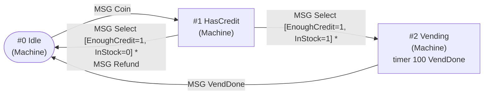

# libadlib

**ADLIB — Authoring and Design Language for Interactive Behavior**

[](https://github.com/vomitselfie/libadlib/actions/workflows/ci.yml)
[](LICENSE)


**ADLIB** is a small language for
describing how game characters behave and react, plus the compiler, tools and runtime around it.
A **plan** is a set of **behaviours** (states). Each behaviour has **interactors** that react to
messages and collisions by running **actions**, consulting **decisions**, scheduling timers and
switching to another behaviour. The game supplies the vocabulary (the names of its messages,
actions, decisions and behaviour types) and implements the primitives in C++. Plans are data:
they are compiled to compact `.PBN` p-code and interpreted by the runtime.

This package is a reconstruction of the ADLIB system that Stuart Rosen and Robert Duisberg's
studio **Wizbang!** built and used for Activision's **HyperBlade** (1996), recovered from the
shipped game and documented so that it can be used again.

| component | what it is |
|---|---|
| **libadlib** | the runtime VM (behaviours, interactors, agenda, message queue, decision paths for lockstep networking), PBN reader/writer, vocabulary loader, host API; C++17, no dependencies |
| **adlibc** | the compiler, ADLIB source → `.PBN`; byte-identical to the 1996 compiler in `--compat=adlib1996` mode |
| **adlib** (adlib-tools) | `dump`, `decompile`, `graph` (DOT/Mermaid), `inspect`/`lint`, `compare`, `trace` |

```text
Compiler compatibility (vs. the original 1996 compiler, --compat=adlib1996)
───────────────────────────────────────────────────────────────────────────
32 / 32 shipped plans          byte-identical
17,547 / 17,547 fuzz cases     identical
185 compatibility fixtures     passing
```

## Status and guarantees (v0.1.0)

- **The compiler is byte-exact.** In `--compat=adlib1996` mode, adlibc matches the original 1996
  compiler byte for byte for accepted inputs and reproduces its diagnostics (message, line, byte
  offset) for rejected inputs. The default `--compat=adlib` preserves the recovered language while
  lifting fixed implementation limits that are not part of the language itself. The evidence was
  produced against the original executable (HyperBlade's, 1996), run under emulation next to
  adlibc:
  - a compatibility corpus of 185 fixtures (`fixtures/compiler/`) whose expectations are the
    original compiler's results with the package's own symbol files; `ctest` replays them with no
    external data;
  - differential fuzzing: **17,547 / 17,547** compared cases identical in the final v0.1
    campaign (0 mismatches; every earlier mismatch is a permanent fixture);
  - all 32 plans shipped with HyperBlade rebuild **byte-identically** from source, and decompiled
    plans recompile byte-identically through both compilers.
- Two modes: `--compat=adlib` (default; the 1996 language with the 1996 implementation's limits
  lifted) and `--compat=adlib1996` (the 1996 compiler exactly, fixed limits included; refuses input
  the original would crash or hang on). `--strict` warns about historical hazards without changing
  the output.
- The runtime is an independent reconstruction of the 1996 interpreter semantics, made
  host-agnostic.
- The language specification ([docs/language.md](docs/language.md)) contains only rules confirmed
  against the original compiler.

## Quickstart

```sh
cmake -S . -B build -DCMAKE_BUILD_TYPE=Release
cmake --build build
ctest --test-dir build              # the test suite, no external data needed
./build/vending_machine             # run the hello-world host
```

The hello world is the **vending machine**, the example Rosen & Duisberg used to explain ADLIB in
1996. Its plans are ADLIB source ([examples/vending_machine/VENDING.txt](examples/vending_machine/VENDING.txt)),
compiled at build time against the game's own vocabulary header:

```sh
cd examples/vending_machine
../../build/adlibc --enumids VENDING.H --texts VENDTEXT.LST --strict -o VENDING.PBN VENDING.txt
../../build/adlib --symbols . graph --mermaid VENDING.PBN
```

```
DECLARE_BEHAVIOR 6 id_BEH_Machine "HasCredit"
    SET_MESSAGE_INTERACTOR 2 id_MSG_Select
        Enable 1
            DECIDE_BY_AMONG 3 id_DCF_EnoughCredit     // the decision returns the branch: 0 = no
                Block 2
                    DO_ACTION 2 id_ACF_Display id_TXT_T_NeedMore
                    CHANGE_TO_BEHAVIOR 1 _NO_BEH_CHANGE_
                DECIDE_BY_AMONG 3 id_DCF_InStock
                    Block 3
                        DO_ACTION 2 id_ACF_Display id_TXT_T_SoldOut
                        DO_ACTION 1 id_ACF_ReturnChange
                        CHANGE_TO_BEHAVIOR 1 "Idle"
                    CHANGE_TO_BEHAVIOR 1 "Vending"
```

The graph `adlib graph --mermaid` produces for it (edge labels give the trigger and the decision
path; `*` marks a change made inside the action list):



And a run with the trace sink on (`./build/vending_machine --trace "obj=machine,kind=MSG|DCF|CHANGE|TIMER"`):

```
t=1100ms customer: Select
      [tick 10] obj=machine(0) plan=VENDING beh=HasCredit MSG Select data=0 from=1
      [tick 10] obj=machine(0) plan=VENDING beh=HasCredit DCF EnoughCredit -> 1
      [tick 10] obj=machine(0) plan=VENDING beh=HasCredit DCF InStock -> 1
      [tick 10] obj=machine(0) plan=VENDING beh=HasCredit CHANGE HasCredit -> Vending
      [tick 10] obj=machine(0) plan=VENDING beh=Vending MSG Initiate data=0 from=0
  *clunk* a snack drops (stock now 0)
      [tick 10] obj=machine(0) plan=VENDING beh=Vending TIMER set 100 VendDone -> 0
t=1100ms machine: HasCredit -> Vending
```

Using it from CMake:

```cmake
find_package(adlib 0.1 CONFIG REQUIRED)       # after `cmake --install build`
target_link_libraries(mygame PRIVATE adlib::adlib)   # + adlib::tools for the trace sink
# or: add_subdirectory(adlib) and link adlib / adlib_tools
```

## Documentation

- [Getting started](docs/getting-started.md): build options, install, first plan, tests.
- [Writing a plan](docs/writing-a-plan.md): the language, as a tutorial on the vending machine.
- [Embedding the runtime](docs/host-api.md): vocabulary headers, registering primitives by name,
  `PlanHost`, ticking, messages, decision paths for lockstep networking.
- [Language specification](docs/language.md): every rule confirmed against the original compiler.
- [adlibc](docs/adlibc.md): modes, `--strict`, diagnostics, quirks policy.
- [adlib-tools](docs/tools.md): decompile, graph, inspect/lint, compare, trace.
- [Compatibility](docs/compatibility.md): fixture corpus, fuzzing methodology, release criterion.
- [Provenance](docs/provenance.md): binary evidence, hashes, research notes.
- [CHANGELOG](CHANGELOG.md), [CONTRIBUTING](CONTRIBUTING.md), [NOTICE](NOTICE.md).

## History

Rosen and Duisberg described ADLIB in *Game Developer* (Aug/Sep 1996, "Bringing Life to
HyperBlade") as three parts: a language for behaviours and interactions, an authoring
environment, and a run-time system; plans compiled to "a compact p-code representation" by a
compiler integrated into the game, and networked play that sends "indices into duplicate plan
instruction streams" rather than state. HyperBlade shipped the compiler inside the game executable
and the plans as `.PBN` files. This reconstruction recovered the language from that compiler (by
static analysis and by running it under emulation), wrote a new compiler that matches it byte for
byte, reimplemented the runtime's semantics independently (first inside a source port of the game,
then as this host-agnostic library), and added the tooling the original authors listed as goals
(checking, graphs, tracing). See [docs/provenance.md](docs/provenance.md).

## Citing

If you use or write about libadlib, please cite it using [CITATION.cff](CITATION.cff) (GitHub's
"Cite this repository" button).

## Licence

MIT, see [LICENSE](LICENSE). This project is not affiliated with or endorsed by Activision or
Wizbang!; see [NOTICE.md](NOTICE.md). The package contains no code, data or plans from the
original game.
