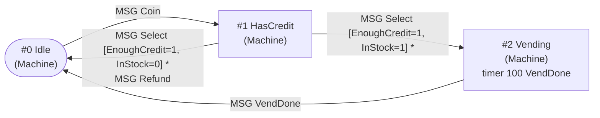

# adlib-tools: inspecting, decompiling, graphing and tracing ADLIB plans

`adlib-tools` is the tool set around [libadlib](host-api.md). It has a library, `adlib_tools`
(`include/adlib/tools.h`, `src/tools/`), and one multi-command CLI,
`adlib` (`tools/adlib-cli.cpp`). The compiler, `adlibc`, is a separate tool
([adlibc.md](adlibc.md)). The two take the same vocabulary options, so a decompiled plan can go
straight back into the compiler.

| command | what it does |
|---|---|
| `dump` | raw token dump (`--tokens`), symbolic tree (`--tree`, default) or the loader's view (`--raw`) |
| `decompile` | PBN → ADLIB compiler source that **recompiles byte-identically** |
| `graph` | behaviour-transition graph of a plan, or of all plans in a directory, as DOT or Mermaid |
| `inspect` / `lint` | statistics, structural lint, unknown ids, unreachable behaviours |
| `compare` | structural diff of two PBNs with tree paths |
| `trace` | filters a run-time trace log. The trace itself comes from `adlib::tools::Tracer` in a host |

Build: `cmake -S . -B build && cmake --build build`, then `ctest --test-dir build`. Option
`ADLIB_BUILD_TOOLS=OFF` skips the tools (and adlibc). The examples use the vending machine
(`build/vending_plans/` holds its compiled plans).

## Vocabulary options

Every command takes these options, either before or after the command name. They are the same as
adlibc's:

| option | loads |
|---|---|
| `--enumids F [--anims F] [--sounds F] [--texts F]` | the four 1996 symbol files given one by one |
| `--symbols DIR` | the 1996 layout (`enumIDs.h`, `AnimData/Animassm.txt`, `Sndfiles.lst` as `id_SND_*`, `Infobtxt.lst` as `id_TXT_*`, read with the 1996 compiler's own tokenizer and order), or else every `*.H` enum header followed by every `*.LST` list. A list's namespace is its upper-case file stem. Use this for the vending machine. |
| `--enum FILE`, `--list NS=FILE` | single files |
| `--hint ACF:i=NS` | argument `i` of action `ACF` names a symbol in namespace `NS` (`@Message` = the Message role). Built in: `SendMessage:2` → messages. A game adds its own, e.g. `--hint PlaySound:1=Sounds` |

Without a vocabulary, the tools print numbers.

## decompile

```
adlib --symbols mygame/ decompile -o src/ mygame/PLANS
adlib --symbols examples/vending_machine decompile -o - build/vending_plans/VENDING.PBN
```

It walks the raw
token stream rather than the loaded tree, because the original compiler is a flat token translator
([research/grammar.md](research/grammar.md) §1). Every keyword is printed with the child count that is stored after
it. Each value gets a spelling that the compiler turns back into exactly the same dwords:

- A value gets a symbol name only when the compiler's case-insensitive, first-match lookup returns
  that same value for the name. A name the original tokenizer would not treat as an identifier
  (its prefix is not `id`, `_`, `A_` or `AA_`) is printed as a number. Symbols are chosen by
  position: message, collision, ACF, DCF, agenda, behaviour-type and parameter ids, `SET_TIMEOUTMSG`
  messages, pronouns (`id_PRN_*`) and the action argument hints. When two names compile to the same value (an
  enum entry and a list entry, say), either spelling round-trips.
- Integers with |v| < 0x100000 are printed in decimal. Anything larger is printed as the shortest
  decimal containing a `.` that maps back to the same float bits. If no such decimal exists, the
  value is printed as `0x…`. Local-real and interactor-name references (`0xEDCB…`, `0xDCBA…`) are
  printed in hex.
- Behaviour references are printed as `"Name"`, but only when the name is the first one declared
  with that index. A `CHANGE_OF_PLAN` target behaviour is printed by name when the sibling plan's
  PBN is in the same directory (or in `--plans DIR`). The compiler then needs that sibling's `.txt`.
- Strings that cannot be written in compiler source make the decompiler fail. Such a string
  contains `_`, a quote, a separator or a comment start, or is longer than 37 characters.

Options:
- `--annotate` adds `//` comments. A behaviour declaration gets `// #i`. The first line of each
  decision branch gets `// =k`, the value the decision returns for that branch. A numeric
  behaviour reference gets the behaviour's name.
- `--annotate-offsets` also adds the dword offset `@N` of every statement.
- `--crlf` writes CRLF line ends. `--no-header` leaves out the comment block at the top. `-o DIR`
  writes `DIR/<PLAN>.txt`.
- The original compiler reads at most 79,999 source bytes, so `adlib` warns when its output is
  larger. (Real plans of 66 KB cross it only with `--annotate-offsets --crlf`.)

Example output (`--annotate`, from the vending machine):

```
DECLARE_BEHAVIOR 6 id_BEH_Machine "HasCredit"  // #1
    SET_MESSAGE_INTERACTOR 2 id_MSG_Select
        Enable 1
            DECIDE_BY_AMONG 3 id_DCF_EnoughCredit
                Block 2  // =0
                    DO_ACTION 2 id_ACF_Display 2
                    CHANGE_TO_BEHAVIOR 1 _NO_BEH_CHANGE_
                DECIDE_BY_AMONG 3 id_DCF_InStock  // =1
                    Block 3  // =0
                        DO_ACTION 2 id_ACF_Display 4
                        DO_ACTION 1 id_ACF_ReturnChange
                        CHANGE_TO_BEHAVIOR 1 "Idle"
                    CHANGE_TO_BEHAVIOR 1 "Vending"  // =1
```

### Round-trip verification

Decompiled source recompiles to the same bytes. This was verified on the 32 plans shipped with
HyperBlade (1996): decompile, then compile with adlibc and with the original 1996 compiler, then
compare with the shipped files; 32/32 byte-identical from both plain and `--annotate` output
([compatibility.md](compatibility.md)). `adlib_tools_test` checks the round trip on the vending
machine.

## graph

```
adlib --symbols examples/vending_machine graph build/vending_plans/VENDING.PBN -o VENDING.dot
adlib --symbols examples/vending_machine graph --mermaid build/vending_plans/VENDING.PBN
adlib --symbols examples/vending_machine graph --all build/vending_plans -o ALL.dot  # plans + CHANGE_OF_PLAN
adlib --symbols examples/vending_machine graph --all --full build/vending_plans      # one cluster per plan
dot -Tsvg VENDING.dot -o VENDING.svg
```

What the graph contains:

- **Nodes** are behaviours, labelled `#index name`, the behaviour type and its timers
  (`timer <delay> <msg>`, plus `-> recipient` when the recipient is not `Me`). Behaviour 0, the
  usual entry, has a bold border. A behaviour with no interactors is marked; the runtime falls
  through from it to the next behaviour (dotted edge).
- **Edges** are `CHANGE_TO_BEHAVIOR` targets. Each label gives the trigger (`MSG x`,
  `COLL mine/other`, `LOCMSG`/`NETMSG`) and, in brackets, the decision path that leads to the
  change, e.g. `MSG Select [EnoughCredit=1, InStock=1]`. A `*` marks a change made inside the
  `Enable` list; no `*` means the interactor's own `CHANGE_TO_BEHAVIOR` option. Parallel edges are
  merged (`+N more` after `maxLabels`). `_NO_BEH_CHANGE_` draws no edge. `_PREVIOUS_BEH_` points to
  a `_PREVIOUS_BEH_` node.
- **GLOBAL_INTERACTORS** get one node, "any behaviour". Its edges fire in every behaviour.
- **`CHANGE_OF_PLAN`** edges go to `PLAN:Behaviour` nodes, shown with a component shape and
  orange edges. In `--all` they connect plans; plans with no plan edges are dashed.
- Options: `--no-cond`, `--no-timers`, `--no-globals`.

The vending machine (`adlib --symbols examples/vending_machine graph --mermaid VENDING.PBN`;
the output starts with a `title:` front-matter block, omitted here):



`graph --all` scales to a whole game: it draws every plan as a cluster with the
`CHANGE_OF_PLAN` links between them (it was developed on a cast of 32 plans and 185 behaviours).

## inspect / lint

```
adlib --symbols examples/vending_machine inspect build/vending_plans/VENDING.PBN
adlib --symbols examples/vending_machine lint build/vending_plans   # errors/warnings only; exit 1 on errors
```

The report covers:
- **Behaviours**: index, name, type, interactor, parameter and transition counts.
- **Global interactors**, totals, and the `CHANGE_OF_PLAN` targets.
- **Node counts** by statement keyword.
- **Symbol usage**: actions, decisions, messages handled, messages sent (SendMessage),
  timer messages, agenda items, behaviour types and parameters, pronouns.
- **Issues**:
  - *lint*, described below.
  - *unknown ids*: an ACF, DCF, MSG, COB, AGD, BEH, SET or PRN id that is not in the vocabulary.
    An id equal to the enum's `NUM…` sentinel is a warning.
  - *unreachable behaviours*: a behaviour that no `CHANGE_TO_BEHAVIOR` or fallthrough reaches
    from #0, and that no global interactor targets. When the plan's directory is known, the
    `CHANGE_OF_PLAN` entries of the other plans count as roots too. In the shipped data these
    behaviours are entered by the host, so they are warnings, not errors.

Abridged sample (the vending machine):

```
plan VENDING  (224 dwords)

behaviours (3):
  #0   Idle                     Machine                 3 interactors  0 params   1 transitions
  #1   HasCredit                Machine                 4 interactors  0 params   3 transitions
  #2   Vending                  Machine                 3 interactors  0 params   1 transitions
global interactors (0)
interactors total: 10, transitions: 5, timers: 1
...
symbol usage:
  actions (5 distinct): Displayx8 ReturnChangex3 AddCreditx2 Dispense SendMessage
  decisions (2 distinct): EnoughCredit InStock
  messages handled (5 distinct): Coinx3 Initiatex3 Selectx2 Refund VendDone
...
issues: 0 errors, 0 warnings, 0 info
```

### Lint rules (`adlib::tools::lintPlan`)

The rules work on the loaded tree. The child counts *are* the tree structure, so a count that is
"wrong" shows up as statements in the wrong place. **Errors** are inputs the runtime rejects or
misreads: `Behavior::setup` and `PlanObject::execute` throw "Invalid Instruction object".
**Warnings** are departures from the conventions that all 32 shipped plans follow
([research/grammar.md](research/grammar.md) §4/§5.2).

| statement | rule |
|---|---|
| top level | only `GLOBAL_INTERACTORS`, `DECLARE_BEHAVIOR`, `DECLARE_LOCAL_REALS`, `END_PLAN` (error); `END_PLAN` present (error); at least one behaviour (error); `GLOBAL_INTERACTORS` before behaviours (warning); dwords after `END_PLAN` (warning) |
| `DECLARE_BEHAVIOR` | ≥ 2 children: type value, name string (error); later children are interactors or `SET_BEHAVIOR_PARAM` (other classes the runtime ignores or runs at setup are warnings; values and other statements are errors); no interactors = falls through (info) |
| interactors | message id / two COB values (error); options only `CHANGE_TO_BEHAVIOR`/`CHANGE_OF_PLAN`/`Enable`/`SET_INTERACTOR_PARAM`/`SET_DEBUG`/`SET_TRACE` (error); shipped order is CHANGE, then Enable; at most one of each (warning); neither present (warning) |
| `Enable`, `Block`, decision branches | every child is an action statement (error); empty `Block` (warning) |
| `DO_*` | ≥ 1 child, function id is a value (error); arguments are values (warning) |
| `DECIDE_BY_AMONG` | dcf value (error); ≥ 1 branch (warning) |
| `DECIDE_BY_WITH_AMONG` | child 1 is a `DataBlock` (error); ≥ 1 branch (warning) |
| `CHANGE_TO_BEHAVIOR` | exactly 1 value (warning); index < number of behaviours, or special (warning: the runtime wraps) |
| `CHANGE_OF_PLAN` | exactly 2 children: plan name string (error), behaviour value |
| `SET_*_PARAM`, `ADD_AGENDA_ITEM` | ≥ 1 child, id is a value (error) |
| `REMOVE_AGENDA_ITEM` | exactly 1 (warning) |
| `SET_TIMEOUTMSG` | 3–4 children (fewer than 3 is an error: the runtime reads the recipient unconditionally) |
| `SET_DEBUG` / `SET_TRACE` | info: ignored by the runtime |
| any | count bit 15 set (warning: never in shipped data; the loader masks it) |

All 32 shipped plans are lint-clean (0 errors). These rules are meant for `adlibc --strict` as
well. adlibc's `--strict` currently checks token-level hazards in the source (dropped words and
similar, `src/compiler/strict.cpp`). `lintPlan()` is the shared tree-level implementation:
adlibc can call it on its output words via `buildPlanTree`.

## compare

```
adlib --symbols examples/vending_machine compare VENDING.PBN VENDING-slower.PBN
```

`compare` loads both plans and aligns each child list by longest common subsequence. Children are
matched on a signature made of the statement and its first value; behaviours are also matched by
name. It recurses into aligned pairs and reports values that changed, statements that were added
or removed, and count bit-15 differences. Each report line carries a tree path, and values get
names from their position:

```
/2:DECLARE_BEHAVIOR"Vending"/2:SET_MESSAGE_INTERACTOR(Initiate)/1:Enable/1:SET_TIMEOUTMSG/0: value
    - 100 (0x64)
    + 150 (0x96)
1 difference
```

A path segment is `childIndex:STATEMENT` plus a key: the behaviour name, the message, the
decision or the action. The exit status is 0 when the plans are identical and 1 when they
differ. If the trees match but the token streams differ (bytes after `END_PLAN`), it says so.

## trace: the run-time trace sink

libadlib's `Registry` has a structured hook, `traceEvent`, alongside the older string `trace`.
The interpreter calls it wherever it already traced: messages, collisions, ACF/DCF calls (and
decision-path replays), behaviour changes and fallthroughs, `CHANGE_TO_BEHAVIOR` requests, plan
changes and activations, agenda add/remove, timers set and fired, and parameter setters. The hook
does nothing when it is unset (and does not change the simulation when set).

`adlib::tools::Tracer` turns those events into lines:

```
[tick N] obj=<name>(<index>) plan=<P> beh=<B> <EVENT>
  MSG Coin data=0 from=1          COLL Body/Ball                DCF EnoughCredit -> 1  [(replay)]
  ACF SendMessage(Customer, Dispensed)                         CHANGE HasCredit -> Vending [(fallthrough)]
  NEXT Vending                    PLAN -> Human / PLAN request X beh #3
  AGENDA + CStepAnimation         AGENDA - CStepAnimation       TIMER set 100 VendDone -> Me / TIMER fire VendDone -> 0
  PARAM beh InteractorLatency
```

The `plan=` and `beh=` fields hold the object's active plan and behaviour at the moment of the
event.

**Filter** syntax: comma-separated clauses; `|` separates alternatives; `*` is a wildcard;
matching ignores case.

| clause | effect |
|---|---|
| `obj=machine\|4` | object name or index |
| `plan=VENDING`, `beh=Has*` | active plan / behaviour (a `CHANGE` line matches on either end) |
| `msg=Coin` | keeps each matching `MSG` line and the events after it for that object in the same tick, until the next `MSG`/`COLL`. Also keeps `TIMER` lines for that message |
| `acf=Send*`, `dcf=EnoughCredit` | restrict `ACF` / `DCF` lines |
| `kind=MSG\|DCF\|CHANGE` | event kinds: `MSG COLL DCF ACF CHANGE NEXT PLAN AGENDA TIMER PARAM`. The default is all except `NEXT` and `PARAM`; `kind=*` selects every kind |
| `tick=100..200`, `tick=..50`, `tick=7` | tick range |
| `all` / `1` / empty | everything (default kinds) |

### Using it

- **Any host:** `auto t = adlib::tools::Tracer::attach(registry, "obj=0,kind=MSG|CHANGE");`.
  Optionally set `t->tick` (the default is the scene clock), `t->objectName` and `t->sink` (the
  default is stderr). `attach` chains any existing `traceEvent` hook.
- **Vending machine:** `./vending_machine [data] [out] --trace FILTER`. The tick is the script
  frame.
  ```
  $ ./vending_machine --trace "obj=machine,kind=MSG|DCF|CHANGE|TIMER,tick=8..12"
  t=1100ms customer: Select
        [tick 10] obj=machine(0) plan=VENDING beh=HasCredit MSG Select data=0 from=1
        [tick 10] obj=machine(0) plan=VENDING beh=HasCredit DCF EnoughCredit -> 1
        [tick 10] obj=machine(0) plan=VENDING beh=HasCredit DCF InStock -> 1
        [tick 10] obj=machine(0) plan=VENDING beh=HasCredit CHANGE HasCredit -> Vending
        [tick 10] obj=machine(0) plan=VENDING beh=Vending MSG Initiate data=0 from=0
    *clunk* a snack drops (stock now 0)
        [tick 10] obj=machine(0) plan=VENDING beh=Vending TIMER set 100 VendDone -> 0
  ```
- **A game host** typically wires it to a command-line flag or an environment variable, with
  its own tick and object names, and adds its own message-sending actions to
  `Tracer::messageArgs`.
- **Offline:** `adlib trace FILTER [LOG]` applies the same filter to a saved log (stdin by
  default). Any prefix before `[tick` is ignored. It exits 1 when no line matches.
  ```
  ./vending_machine ... --trace all > vend.log
  adlib trace "msg=Select,beh=HasCredit" vend.log
  ```

## Library API (summary)

All names are in namespace `adlib::tools`; see `tools.h`.

- **Symbols:** `SymbolTable` (`lookup` is `_stricmp` first match; `nameIn(ns, v)` returns a name
  only when it round-trips), `loadCompilerSymbolsDir`, `loadCompilerSymbolFiles`, `loadSymbolsDir`,
  `loadEnumFile`, `loadListFile`.
- **Decompiler:** `decompile(words, syms, DecompileOptions, out, &err)`, `behaviourNames(words)`,
  `formatFloatLiteral(bits)`.
- **Analysis and graphs:** `analyze(tree, syms, planBehaviours)` → `PlanModel` (behaviours,
  transitions with trigger, decision path and tree path, timers, globals); `graphDot`,
  `graphMermaid`, `graphDotAll`, `graphMermaidAll`.
- **Inspect:** `lintPlan`, `checkIds`, `unreachableBehaviours`, `inspectReport`.
- **Compare:** `comparePlans(a, b, syms, out)` returns the number of differences.
- **Trace:** `TraceFilter`, `Tracer::attach`, `traceLineMatches`. libadlib provides
  `adlib::TraceEvent` and `Registry::traceEvent`.

Load trees for the tools with identity hooks (`buildPlanTree(words, LoadHooks{}, tree)`). Pronouns
and `CHANGE_OF_PLAN` plan names then stay symbolic.

## Tests

`ctest --test-dir build` runs, with no external data:
- `adlib_test`: libadlib.
- `adlib_tools_test`: floats, decompile, graph, lint, ids, compare and a live trace with filters
  on the vending-machine plans.
- `adlibc_test`, `vending_machine`, `cli_version`, `cli_graph_mermaid`.
